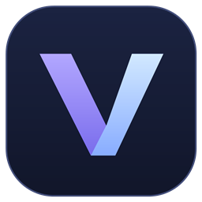

<p align="center"></p>

# VoiceMorph

Голосовая мастерская для Windows: лёгкие DSP-профили и отдельный экспериментальный режим преобразования голоса через RVC.

**Windows 11 x64 · C# / .NET 10 / WPF · WASAPI · Python / PyTorch для RVC**

## Два режима

| Режим | Назначение | Зависимости |
| :--- | :--- | :--- |
| **DSP** | Изменение высоты, формант, спектрального баланса и динамики | .NET; без нейромодели и GPU |
| **RVC** | Преобразование через импортированную голосовую модель | Отдельный Python-runtime и модель |

- Шесть встроенных профилей, 31 параметр обработки и пользовательские копии.
- Подбор стартового DSP-профиля по анализу своего и целевого голоса.
- Импорт / экспорт JSON, сравнение исходной и обработанной записи.
- Библиотека RVC v1/v2 `.pth` и необязательных `.index`.
- Ограниченная очередь обработки, показатели CPU/RAM и оценка задержки.
- Вывод в виртуальный аудиокабель и подключение источника OBS.

## Сборка

```powershell
./tools/build.ps1
./tools/publish.ps1
./tools/run.ps1
```

Нужны Windows и .NET 10 SDK. SDK вне PATH задаётся через `DOTNET_ROOT_X64`. Для опубликованной папки нужен .NET Desktop Runtime 10; `publish.ps1 -SelfContained` включает runtime. DSP работает без Python.

## Необязательный RVC-runtime

```powershell
./tools/setup-rvc-runtime.ps1 -RuntimeRoot 'D:/VoiceMorphRuntime'
$env:VOICEMORPH_RUNTIME_ROOT = 'D:/VoiceMorphRuntime'
./tools/run.ps1
```

GPU-вариант скачивает несколько гигабайт; во время установки требуется не менее 9 ГБ свободного места. `-CpuOnly` устанавливает более компактный вариант, но не гарантирует обработку живой речи в реальном времени. Скрипт не устанавливает драйвер GPU и не меняет системный Python.

Путь к Python можно переопределить через `VOICEMORPH_PYTHON`, каталог библиотеки моделей — через `VOICEMORPH_MODEL_ROOT`. Без переменных runtime и модели ищутся рядом с приложением. Протокол и ограничения описаны в [runtime/README.md](runtime/README.md).

Модели конкретных голосов не распространяются вместе с приложением. Используйте файлы из доверенного источника и проверяйте разрешение на их использование. Импорт сам по себе не гарантирует безопасность. Индекс выключен, пока пользователь отдельно не подтвердит доверие.

## Маршрут звука

```text
Микрофон → VoiceMorph → CABLE Input → CABLE Output в игре / Discord / OBS
```

Не захватывайте исходный микрофон параллельно обработанному. При подключении к OBS нужен его локальный WebSocket v5. Во время активной записи или эфира аудионастройки не меняются.

## Что ожидать от звучания

DSP-профиль по примеру приближает параметры тембра, но не воспроизводит личность, манеру речи и актёрскую интонацию. RVC зависит от модели, исходной записи и высоты голоса; в живом режиме возможны артефакты на границах блоков.

Размер блока 200/320/480 мс — не полная задержка. К нему добавляются inference, очередь и WASAPI. Сходство «1:1», отсутствие задержки и стабильный FPS не обещаются. Сначала проверьте короткую запись, затем работу вместе с игрой.

## Проверки

`build.ps1` запускает проверки DSP, анализа и импорта без захвата микрофона. Проверки реальных аудиоустройств выполняются отдельно с `--devices`, проверка собственных моделей — с `--verify-neural-models`.

Записи калибровки, настройки, импортированные модели и результаты тестов исключены из Git. См. [зависимости](THIRD-PARTY-NOTICES.md).
